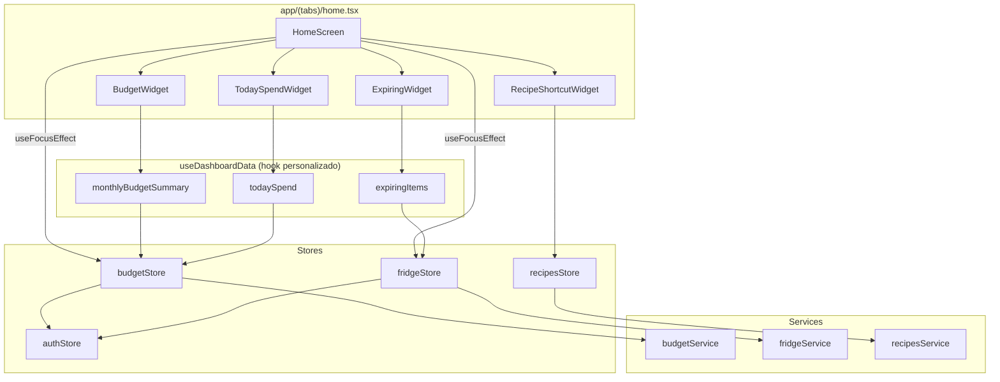
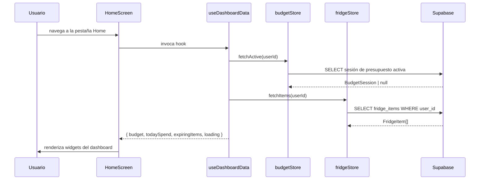
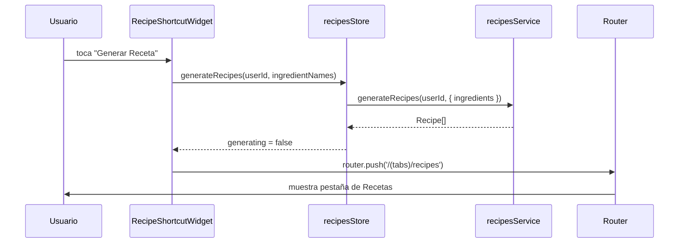

# Documento de Diseño: Dashboard de Pantalla de Inicio

## Overview

El Dashboard de Pantalla de Inicio transforma el placeholder existente `app/(tabs)/home.tsx` en una vista completa del estado alimentario del usuario. Consolida cuatro superficies de información — progreso del presupuesto mensual, gasto del día, productos próximos a vencer en 7 días, y un atajo para generar recetas — en una sola pantalla con scroll. Todos los datos provienen de stores Zustand ya existentes (`budgetStore`, `fridgeStore`) y servicios, por lo que no se requieren nuevos endpoints ni tablas en la base de datos.

La pantalla reemplaza el layout de tarjetas ad-hoc actual con widgets de dashboard de propósito específico renderizados dentro de un `ScrollView` bajo un `SafeAreaView`, siguiendo las convenciones de pantalla establecidas en el proyecto. Los datos se vuelven a obtener cada vez que la pestaña recibe foco mediante `useFocusEffect`, manteniendo el dashboard actualizado sin necesidad de gestos de recarga manual.

El modal de configuración (toggle biométrico + cerrar sesión) que ya existe en la pantalla se conserva sin cambios; solo se rediseña el área de contenido principal.

---

## Architecture



---

## Diagramas de Secuencia

### Montaje / Foco de Pantalla



### Atajo de Generación de Recetas



---

## Components and Interfaces

### Componente: `HomeScreen` (`app/(tabs)/home.tsx`)

**Propósito**: Componente de pantalla raíz. Orquesta el fetching de datos mediante `useFocusEffect` y compone los cuatro widgets del dashboard más el modal de configuración existente.

**Responsabilidades**:
- Llamar a `useDashboardData()` para obtener el estado derivado del dashboard
- Renderizar widgets en un `ScrollView` dentro de `SafeAreaView`
- Conservar el modal de configuración (biométrico + cerrar sesión) sin cambios
- Pasar `router` y `colors` como props a los widgets

---

### Componente: `BudgetWidget`

**Propósito**: Muestra el presupuesto mensual de compras: monto total, monto gastado y una barra de progreso visual.

**Interfaz**:
```typescript
interface BudgetWidgetProps {
  session: BudgetSession | null;
  loading: boolean;
  colors: typeof Colors.light;
}
```

**Responsabilidades**:
- Mostrar "Sin presupuesto activo" cuando `session` es null
- Renderizar barra de progreso: `spent / amount` (limitado al 100%)
- Colorear la barra en verde cuando ≤ 80%, ámbar al 81–100%, rojo si supera el presupuesto
- Navegar a `/(tabs)/shopping` al presionar

---

### Componente: `TodaySpendWidget`

**Propósito**: Muestra el total gastado hoy, derivado de `budgetStore.purchases` filtrado por la fecha actual.

**Interfaz**:
```typescript
interface TodaySpendWidgetProps {
  todaySpend: number;
  currency: string;         // siempre '$' para el contexto del peso colombiano
  colors: typeof Colors.light;
}
```

**Responsabilidades**:
- Mostrar el valor formateado en moneda (ej. `$12.500`)
- Mostrar `$0` cuando no existen compras del día
- Navegar a `/(tabs)/shopping` al presionar

---

### Componente: `ExpiringWidget`

**Propósito**: Lista los items de nevera cuyo `expiry_date` cae dentro de los próximos 7 días calendario (hoy inclusive).

**Interfaz**:
```typescript
interface ExpiringWidgetProps {
  items: ExpiringItem[];    // tipo derivado — ver Modelos de Datos
  colors: typeof Colors.light;
  onItemPress: (itemId: string) => void;
}
```

**Responsabilidades**:
- Mostrar "Todo en orden 🎉" cuando `items` está vacío
- Renderizar hasta 5 items; mostrar enlace "+N más" cuando hay más
- Cada fila muestra nombre del item, chip de categoría y días restantes (badge: verde > 3 días, ámbar 2–3 días, rojo ≤ 1 día)
- Navegar a `app/fridge/[id]` al presionar una fila

---

### Componente: `RecipeShortcutWidget`

**Propósito**: Botón CTA único que dispara la generación de recetas desde el contenido actual de la nevera y navega a la pestaña de Recetas.

**Interfaz**:
```typescript
interface RecipeShortcutWidgetProps {
  ingredientCount: number;
  generating: boolean;
  onGenerate: () => void;
  colors: typeof Colors.light;
}
```

**Responsabilidades**:
- Deshabilitar el botón cuando `ingredientCount === 0` y mostrar texto de ayuda
- Mostrar spinner / texto "Generando…" mientras `generating === true`
- Al terminar, la navegación la maneja `HomeScreen` (no el widget)

---

### Hook: `useDashboardData`

**Propósito**: Centraliza toda la lógica de fetching y deriva los cuatro slices de datos del dashboard desde los stores.

**Interfaz**:
```typescript
interface DashboardData {
  budget: BudgetSession | null;
  budgetLoading: boolean;
  todaySpend: number;
  expiringItems: ExpiringItem[];
  ingredientNames: string[];
  generating: boolean;
  refresh: () => void;
}

function useDashboardData(): DashboardData
```

**Responsabilidades**:
- Suscribirse a `budgetStore`, `fridgeStore`, `recipesStore`, `authStore`
- Exponer una función `refresh()` llamada por `useFocusEffect`
- Derivar `todaySpend` y `expiringItems` con `useMemo` para evitar recálculos en re-renders no relacionados

---

## Data Models

### `ExpiringItem` (derivado, no persistido)

```typescript
interface ExpiringItem {
  id: string;
  name: string;
  category: string;
  expiryDate: string;        // cadena de fecha ISO 'YYYY-MM-DD'
  daysRemaining: number;     // 0 = vence hoy, negativo = ya venció
}
```

**Reglas de derivación**:
- Fuente: `FridgeItem[]` del `fridgeStore`
- Incluir solo items donde `expiry_date` no es nulo
- Incluir solo items donde `daysRemaining` está entre 0 y 7 (inclusive)
- `daysRemaining = differenceInCalendarDays(parseISO(expiry_date), startOfToday())`
- Ordenar ascendente por `daysRemaining`

---

### `BudgetSession` (existente, desde `budgetService.ts`)

```typescript
interface BudgetSession {
  id: string;
  user_id: string;
  amount: number;       // presupuesto total de la sesión
  spent: number;        // gasto acumulado
  status: 'active' | 'completed';
  created_at: string;
  completed_at: string | null;
}
```

Sin cambios a este modelo. El dashboard lo lee en modo solo lectura.

---

### `TodaySpend` (escalar derivado)

Derivado de `BudgetPurchase[]`:

```typescript
// todaySpend: suma de purchase.price para todas las compras donde
// purchase.created_at comienza con el prefijo ISO de hoy 'YYYY-MM-DD'
const todaySpend: number = purchases
  .filter(p => p.created_at.startsWith(todayPrefix))
  .reduce((acc, p) => acc + p.price, 0);
```

---

## Pseudocódigo Algorítmico

### Algoritmo: `computeExpiringItems`

```pascal
ALGORITMO computeExpiringItems(items, windowDays)
ENTRADA:  items      — FridgeItem[] del fridgeStore
          windowDays — entero, por defecto 7
SALIDA:   ExpiringItem[] ordenado ascendente por daysRemaining

INICIO
  hoy ← startOfToday()          // medianoche hora local
  resultado ← []

  PARA cada item EN items HACER
    SI item.expiry_date ES NULL ENTONCES
      CONTINUAR
    FIN SI

    fechaVencimiento  ← parseISO(item.expiry_date)
    diasRestantes     ← differenceInCalendarDays(fechaVencimiento, hoy)

    SI diasRestantes >= 0 Y diasRestantes <= windowDays ENTONCES
      resultado.push({
        id:            item.id,
        name:          item.name,
        category:      item.category,
        expiryDate:    item.expiry_date,
        daysRemaining: diasRestantes
      })
    FIN SI
  FIN PARA

  ORDENAR resultado POR daysRemaining ASC

  RETORNAR resultado
FIN
```

**Precondiciones**:
- `items` es un array válido (posiblemente vacío) de `FridgeItem`
- `windowDays` es un entero positivo

**Postcondiciones**:
- Todos los items retornados tienen `0 ≤ daysRemaining ≤ windowDays`
- El resultado está ordenado ascendente por `daysRemaining`
- Los items con `expiry_date` nulo son excluidos

**Invariantes de Ciclo**:
- En cada iteración, `resultado` contiene solo items que pasaron la verificación de ventana de fechas

---

### Algoritmo: `computeTodaySpend`

```pascal
ALGORITMO computeTodaySpend(purchases)
ENTRADA:  purchases — BudgetPurchase[]
SALIDA:   total — número (≥ 0)

INICIO
  prefijohoy ← formatISO(hoy, 'YYYY-MM-DD')  // ej. "2025-07-14"
  total ← 0

  PARA cada compra EN purchases HACER
    SI compra.created_at COMIENZA_CON prefijohoy ENTONCES
      total ← total + compra.price
    FIN SI
  FIN PARA

  RETORNAR total
FIN
```

**Precondiciones**:
- `purchases` es un array válido (posiblemente vacío) de `BudgetPurchase`

**Postcondiciones**:
- Retorna un número no negativo
- Incluye solo compras con timestamp `created_at` de la fecha de hoy

**Invariantes de Ciclo**:
- `total` es siempre ≥ 0 durante la iteración

---

### Algoritmo: `computeBudgetProgress`

```pascal
ALGORITMO computeBudgetProgress(session)
ENTRADA:  session — BudgetSession | null
SALIDA:   { ratio: número, overBudget: booleano, label: cadena }

INICIO
  SI session ES NULL ENTONCES
    RETORNAR { ratio: 0, overBudget: false, label: 'Sin presupuesto' }
  FIN SI

  ratio      ← session.spent / session.amount       // puede ser > 1.0 si supera el presupuesto
  overBudget ← session.spent > session.amount
  restante   ← session.amount - session.spent

  SI overBudget ENTONCES
    label ← 'Excedido por $' + formatCurrency(abs(restante))
  SINO
    label ← '$' + formatCurrency(restante) + ' restante'
  FIN SI

  RETORNAR { ratio: min(ratio, 1.0), overBudget, label }
FIN
```

**Precondiciones**:
- `session.amount > 0` cuando session no es null (validado en la creación del presupuesto)

**Postcondiciones**:
- `ratio ∈ [0.0, 1.0]` (limitado para la barra de progreso; el valor real se comunica mediante el flag `overBudget`)
- `label` es una cadena legible por humanos no vacía

---

## Funciones Clave con Especificaciones Formales

### `useDashboardData(): DashboardData`

```typescript
function useDashboardData(): DashboardData
```

**Precondiciones**:
- Debe llamarse dentro de un componente React o hook
- `authStore` tiene un `user` autenticado (`user.id` no nulo)

**Postcondiciones**:
- Retorna referencia de objeto estable cuando los valores del store no cambian (memoizado)
- `refresh()` dispara `fetchActive(userId)` y `fetchItems(userId)` en paralelo
- `expiringItems` siempre ordenado ascendente por `daysRemaining`
- `todaySpend ≥ 0`

---

### `getExpiryBadgeColor(daysRemaining: number, colors): string`

```typescript
function getExpiryBadgeColor(daysRemaining: number, colors: typeof Colors.light): string
```

**Precondiciones**:
- `daysRemaining ∈ [0, 7]`

**Postcondiciones**:
- Retorna `'#EF4444'` (rojo) cuando `daysRemaining ≤ 1`
- Retorna `'#F59E0B'` (ámbar) cuando `daysRemaining ∈ [2, 3]`
- Retorna `colors.primary` (verde) cuando `daysRemaining ≥ 4`
- Nunca retorna null ni undefined

---

### `formatCurrency(value: number): string`

```typescript
function formatCurrency(value: number): string
```

**Precondiciones**:
- `value` es un número finito

**Postcondiciones**:
- Retorna una cadena formateada con separador de miles usando punto y sin decimales para números enteros (convención peso colombiano)
- Ejemplo: `12500` → `'12.500'`

---

## Ejemplo de Uso

```typescript
// Uso del hook useDashboardData dentro de HomeScreen
export default function HomeScreen() {
  const router = useRouter();
  const colorScheme = useColorScheme();
  const colors = Colors[colorScheme ?? 'light'];
  const { user } = useAuthStore();
  const { generateRecipes, generating } = useRecipesStore();

  const {
    budget,
    budgetLoading,
    todaySpend,
    expiringItems,
    ingredientNames,
    refresh,
  } = useDashboardData();

  // Refrescar cada vez que esta pestaña recibe foco
  useFocusEffect(
    useCallback(() => {
      refresh();
    }, [refresh])
  );

  const handleGenerate = () => {
    if (!user || ingredientNames.length === 0) return;
    generateRecipes(user.id, ingredientNames);
    router.push('/(tabs)/recipes');
  };

  return (
    <SafeAreaView style={[styles.container, { backgroundColor: colors.background }]}>
      <ScrollView contentContainerStyle={styles.scroll}>
        <DashboardHeader user={user} colors={colors} onSettingsPress={...} />
        <BudgetWidget session={budget} loading={budgetLoading} colors={colors} />
        <TodaySpendWidget todaySpend={todaySpend} currency="$" colors={colors} />
        <ExpiringWidget
          items={expiringItems}
          colors={colors}
          onItemPress={(id) => router.push(`/fridge/${id}` as any)}
        />
        <RecipeShortcutWidget
          ingredientCount={ingredientNames.length}
          generating={generating}
          onGenerate={handleGenerate}
          colors={colors}
        />
      </ScrollView>
    </SafeAreaView>
  );
}
```

---

## Correctness Properties

*Una propiedad es una característica o comportamiento que debe ser verdadero en todas las ejecuciones válidas del sistema — esencialmente, una declaración formal sobre lo que el sistema debe hacer. Las propiedades sirven como puente entre las especificaciones legibles por humanos y las garantías de corrección verificables automáticamente.*

### Property 1: Invariante de Ventana de Vencimiento

*Para cualquier* array de `FridgeItem` (incluyendo items con `expiry_date` nulo), todo `ExpiringItem` retornado por `computeExpiringItems(items, 7)` debe tener `daysRemaining ≥ 0` y `daysRemaining ≤ 7`. Los items con `expiry_date` nulo no deben aparecer nunca en el resultado.

**Validates: Requirements 6.1, 6.2, 6.3, 3.1**

### Property 2: Invariante de Ordenamiento por Vencimiento

*Para cualquier* array de `FridgeItem`, el resultado de `computeExpiringItems(items, 7)` debe estar ordenado ascendente por `daysRemaining`: para cualquier par de elementos consecutivos `a` y `b` en el resultado, `a.daysRemaining ≤ b.daysRemaining`.

**Validates: Requirements 6.4, 3.2**

### Property 3: Filtrado de Gasto por Fecha

*Para cualquier* array de `BudgetPurchase` con timestamps `created_at` variados (abarcando múltiples fechas), `computeTodaySpend(purchases)` debe ser igual a la suma de `price` únicamente de las compras cuyo `created_at` comienza con el prefijo ISO de hoy (`YYYY-MM-DD`). Las compras de otras fechas deben ser excluidas.

**Validates: Requirements 7.1, 2.1**

### Property 4: Gasto del Día No Negativo

*Para cualquier* array de `BudgetPurchase` donde cada `price` es un número no negativo, `computeTodaySpend(purchases)` debe retornar un valor `≥ 0`.

**Validates: Requirements 7.3**

### Property 5: Ratio de Presupuesto Limitado

*Para cualquier* `BudgetSession` no nula con `amount > 0`, `computeBudgetProgress(session).ratio` debe satisfacer `0 ≤ ratio ≤ 1.0`, incluso cuando `spent > amount`.

**Validates: Requirements 8.2, 1.2, 1.3, 1.4**

### Property 6: Umbral de Color del Progreso de Presupuesto

*Para cualquier* `BudgetSession` no nula con `amount > 0`: cuando `spent / amount ≤ 0.80` el color del indicador visual debe ser verde; cuando `0.80 < spent / amount ≤ 1.0` debe ser ámbar; cuando `spent > amount` el flag `overBudget` debe ser `true` y el color debe ser rojo.

**Validates: Requirements 1.2, 1.3, 1.4, 8.3, 8.4**

### Property 7: Color de Badge de Vencimiento por Rango

*Para cualquier* entero `daysRemaining` en `[0, 7]`, `getExpiryBadgeColor(daysRemaining, colors)` debe retornar: `'#EF4444'` cuando `daysRemaining ≤ 1`, `'#F59E0B'` cuando `daysRemaining ∈ {2, 3}`, y `colors.primary` cuando `daysRemaining ≥ 4`. La función nunca debe retornar `null` ni `undefined`.

**Validates: Requirements 10.1, 10.2, 10.3, 10.4, 3.3, 3.4, 3.5**

### Property 8: Separador de Miles en Formato de Moneda

*Para cualquier* entero finito no negativo `value`, `formatCurrency(value)` debe retornar una cadena donde los grupos de tres dígitos desde la derecha están separados por un `.` (punto), y el resultado debe ser una cadena no vacía. Ejemplo: `12500 → '12.500'`, `1000000 → '1.000.000'`, `500 → '500'`.

**Validates: Requirements 9.1, 9.2, 9.3, 9.4, 2.3**

---

## Error Handling

### Escenario de Error 1: Sin Sesión de Presupuesto Activa

**Condición**: `budgetService.getActive(userId)` retorna `null` (sin sesión activa)
**Respuesta**: `BudgetWidget` renderiza el estado "Sin presupuesto activo" con un CTA que enlaza a la pestaña de compras
**Recuperación**: No hay estado de error; este es un estado vacío válido

---

### Escenario de Error 2: Fallo en el Fetching de Presupuesto/Nevera

**Condición**: La llamada a Supabase lanza error (error de red, expiración de auth)
**Respuesta**: Los stores establecen la cadena `error`; el dashboard muestra un mensaje de error inline sutil ("No se pudo cargar la información") con un botón "Reintentar" que llama a `refresh()`
**Recuperación**: El usuario toca Reintentar; los stores intentan hacer el fetching nuevamente

---

### Escenario de Error 3: Fallo en Generación de Recetas

**Condición**: `recipesService.generateRecipes` lanza un error
**Respuesta**: `recipesStore` establece `error`; `RecipeShortcutWidget` muestra mensaje de error inline
**Recuperación**: El botón se rehabilita; el usuario puede intentarlo nuevamente

---

### Escenario de Error 4: Nevera Vacía

**Condición**: `fridgeStore.items` está vacío
**Respuesta**: `RecipeShortcutWidget` deshabilita el botón y muestra "Agrega ingredientes a tu nevera primero"
**Recuperación**: El usuario navega a la pestaña Nevera para agregar items; al volver a Home, `useFocusEffect` vuelve a hacer el fetching

---

## Testing Strategy

### Enfoque de Pruebas Unitarias

Probar las funciones puras derivadas en aislamiento:
- `computeExpiringItems`: variar `expiry_date` relativo a hoy; verificar condiciones de borde de la ventana (día 0, día 7, día 8)
- `computeTodaySpend`: mockear timestamps `created_at` cruzando medianoche
- `computeBudgetProgress`: probar sesión null, en el límite, sobre el límite, bajo el límite
- `getExpiryBadgeColor`: verificar color exacto en valores de borde (1, 2, 4 días)
- `formatCurrency`: probar 0, números enteros, números grandes con separadores de miles

### Enfoque de Pruebas Basadas en Propiedades

Usar **fast-check** para pruebas generativas:

```typescript
// Propiedad: expiringItems siempre dentro de la ventana
fc.assert(fc.property(
  fc.array(fridgeItemArbitrary()),
  (items) => {
    const result = computeExpiringItems(items, 7);
    return result.every(i => i.daysRemaining >= 0 && i.daysRemaining <= 7);
  }
));

// Propiedad: todaySpend siempre no negativo
fc.assert(fc.property(
  fc.array(budgetPurchaseArbitrary()),
  (purchases) => computeTodaySpend(purchases) >= 0
));

// Propiedad: ratio de budgetProgress limitado a [0, 1]
fc.assert(fc.property(
  budgetSessionArbitrary(),
  (session) => {
    const { ratio } = computeBudgetProgress(session);
    return ratio >= 0 && ratio <= 1;
  }
));
```

**Librería de Pruebas de Propiedades**: `fast-check`

### Enfoque de Pruebas de Integración

- Renderizar `HomeScreen` con stores Zustand mockeados (usando `jest` + `@testing-library/react-native`)
- Verificar que cada widget renderiza el texto correcto para un estado de store conocido
- Verificar que `useFocusEffect` dispara `fetchActive` y `fetchItems` al recibir foco

---

## Consideraciones de Rendimiento

- `computeExpiringItems` y `computeTodaySpend` están envueltos en `useMemo` para evitar re-ejecuciones en cada render. Los arrays de dependencias son `[items]` y `[purchases]` respectivamente.
- Se usa `ScrollView` en lugar de `FlatList` porque el dashboard tiene un número fijo y pequeño de widgets (< 10 items por sección). `FlatList` agregaría complejidad innecesaria.
- `ExpiringWidget` limita la visualización a 5 filas; solo el slice derivado `ExpiringItem[]` se renderiza, no la lista completa de items de nevera.
- `useFocusEffect` con `useCallback` garantiza que el closure de refresco sea estable y no cree una nueva suscripción en cada render.

---

## Consideraciones de Seguridad

- Todas las consultas de datos están limitadas al `userId` del `authStore`; las políticas RLS de Supabase también lo refuerzan a nivel de base de datos.
- No se muestra información de identificación personal (salvo los nombres de items elegidos por el usuario) en el dashboard.
- El modal de configuración (toggle biométrico, cerrar sesión) ya está implementado y se conserva sin cambios.

---

## Dependencias

| Dependencia | ¿Ya en el proyecto? | Propósito |
|---|---|---|
| `zustand` | ✅ | Suscripciones a stores |
| `expo-router` | ✅ | Navegación (`useRouter`, `useFocusEffect`) |
| `react-native-safe-area-context` | ✅ | Wrapper `SafeAreaView` |
| `@/stores/budgetStore` | ✅ | Sesión de presupuesto + compras |
| `@/stores/fridgeStore` | ✅ | Items de nevera |
| `@/stores/recipesStore` | ✅ | Generación de recetas |
| `@/stores/authStore` | ✅ | Usuario actual |
| `@/constants/theme` | ✅ | Tokens de `Colors` |
| `@/hooks/use-color-scheme` | ✅ | Modo oscuro/claro |
| `fast-check` | ⚠️ devDependency | Pruebas basadas en propiedades |

No se requieren nuevas dependencias de runtime. `fast-check` es la única adición, y solo como `devDependency`.
