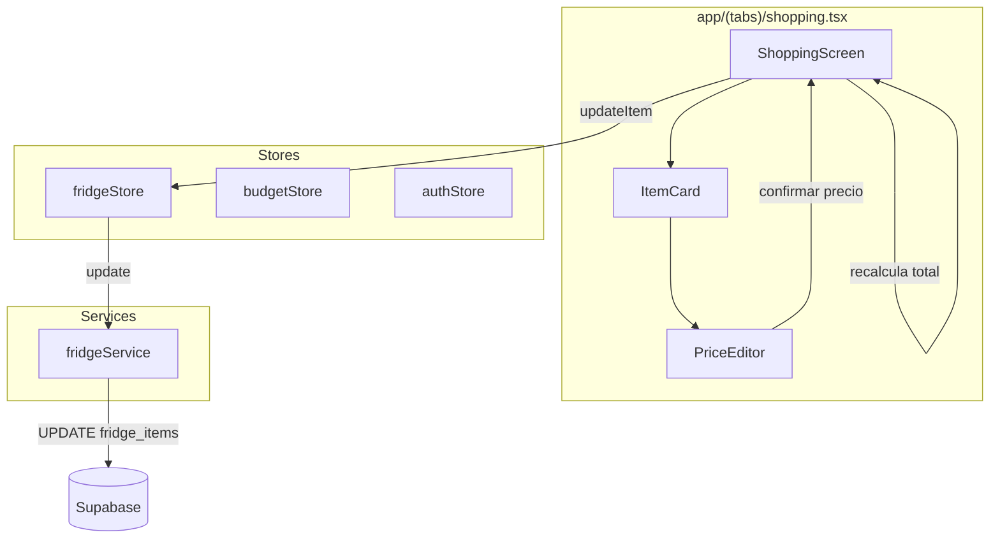
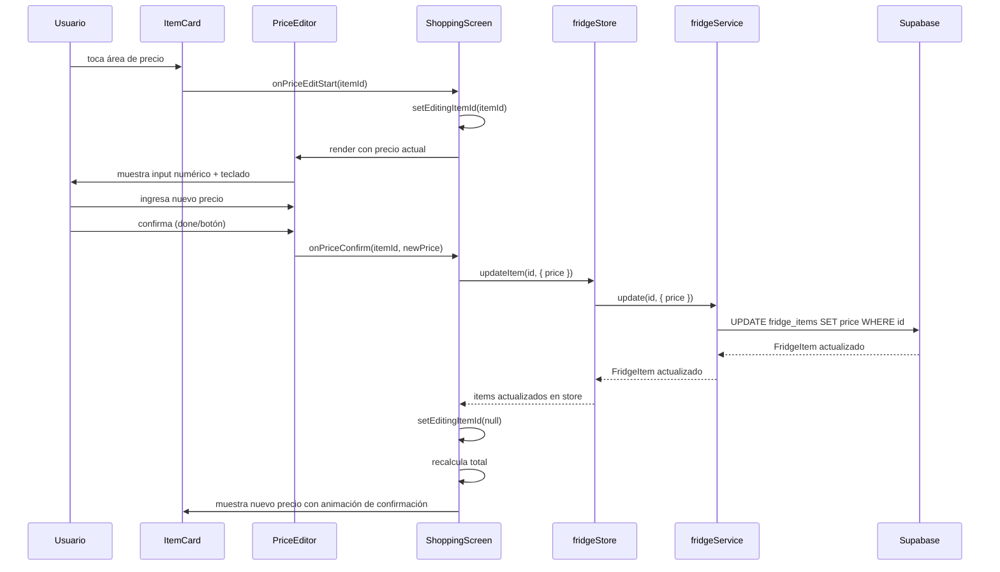
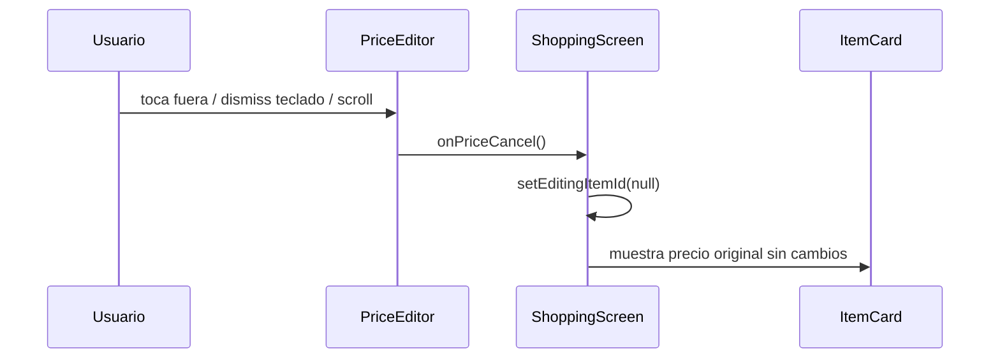

# Documento de Diseño: Edición Rápida de Precio

## Overview

La feature de Edición Rápida de Precio permite a los usuarios modificar el precio de un producto directamente desde la lista de compras (`app/(tabs)/shopping.tsx`) sin tener que navegar a la pantalla de detalle del item. Cuando el usuario toca el área de precio de un `Item_Card`, un componente `PriceEditor` aparece inline reemplazando el texto del precio con un campo de entrada numérica. La edición se confirma o cancela sin abandonar la pantalla, y el precio se persiste vía `fridgeStore.updateItem` → `fridgeService.update` → Supabase.

Esta interacción ahorra tiempo significativo durante sesiones de compras donde el usuario necesita actualizar múltiples precios consecutivamente. El diseño sigue el patrón existente del proyecto: componentes consumen stores, stores llaman servicios, servicios manejan las mutaciones contra Supabase.

No se requieren nuevas tablas ni cambios en el esquema de base de datos — el campo `price` de `fridge_items` ya existe y acepta valores enteros positivos o `null`.

---

## Architecture



### Diagrama de Secuencia: Flujo de Edición Exitosa



### Diagrama de Secuencia: Flujo de Cancelación



---

## Components and Interfaces

### Componente: `PriceEditor` (`components/price-editor.tsx`)

**Propósito**: Campo de edición inline de precio que reemplaza la visualización de precio en un `ItemCard`. Gestiona la entrada de texto, validación local y estados de carga/confirmación.

**Interfaz**:
```typescript
interface PriceEditorProps {
  currentPrice: number | null;
  saving: boolean;
  onConfirm: (newPrice: number | null) => void;
  onCancel: () => void;
  colors: typeof Colors.light;
}
```

**Responsabilidades**:
- Renderizar un `TextInput` con `keyboardType="number-pad"` y auto-focus
- Pre-poblar con el precio actual (convertido a string) o vacío si es `null`
- Mostrar label "$" no editable a la izquierda del input
- Validar que el valor sea un entero positivo entre 1 y 99,999,999 o vacío (null)
- Rechazar el valor 0 (no ejecutar `onConfirm`, mantener el input)
- Deshabilitar el botón de confirmar mientras `saving === true`
- Mostrar spinner en lugar del botón confirmar cuando `saving === true`
- Llamar `onCancel` cuando se detecta un tap fuera (via `Pressable` wrapper en el padre)
- Llamar `onConfirm` con el valor parseado al presionar "done" o botón confirmar

**Estado interno**:
```typescript
const [inputValue, setInputValue] = useState<string>(
  currentPrice != null ? String(currentPrice) : ''
);
```

---

### Modificaciones a `ShoppingScreen` (`app/(tabs)/shopping.tsx`)

**Nuevo estado local**:
```typescript
const [editingItemId, setEditingItemId] = useState<string | null>(null);
const [savingPrice, setSavingPrice] = useState(false);
```

**Nuevo handler `handlePriceConfirm`**:
```typescript
const handlePriceConfirm = async (itemId: string, newPrice: number | null) => {
  setSavingPrice(true);
  try {
    await updateItem(itemId, { price: newPrice });
    // éxito: cerrar editor, disparar flash de confirmación
    setEditingItemId(null);
    setFlashItemId(itemId);
    setTimeout(() => setFlashItemId(null), 400);
  } catch {
    Alert.alert('Error', 'No se pudo guardar el precio. Intenta de nuevo.');
  } finally {
    setSavingPrice(false);
  }
};
```

**Modificaciones al `renderItem`**:
- El área de precio se envuelve en un `TouchableOpacity` con `minHeight: 44` y `minWidth: 44`
- Al tocar, si `editingItemId === null`, se llama `setEditingItemId(item.id)`
- Si `editingItemId === item.id`, se renderiza `<PriceEditor />` en lugar del texto de precio
- Si `editingItemId !== null && editingItemId !== item.id`, el tap en precio se ignora (solo un editor activo)

**Manejo de scroll para cancelar**:
- Agregar `onScrollBeginDrag={() => { if (editingItemId) setEditingItemId(null); }}` al `SectionList`

**Tap fuera para cancelar**:
- Envolver el contenido principal en un `Pressable` que llama `setEditingItemId(null)` cuando se toca fuera del editor activo

---

### Componente: `ItemCard` (inline en `ShoppingScreen`)

**Modificaciones**:
- El área de precio se convierte en un `TouchableOpacity` con target mínimo de 44x44
- Recibe prop `isEditing: boolean` para condicional de renderizado (texto vs `PriceEditor`)
- Recibe prop `isFlashing: boolean` para la animación de confirmación
- Cuando `isEditing === true`, muestra un borde de 2px con `colors.primary`
- Cuando `isFlashing === true`, muestra un fondo con `colors.primary` al 15% de opacidad durante 300-500ms

---

### Función utilitaria: `validatePriceInput`

```typescript
function validatePriceInput(input: string): { valid: boolean; value: number | null } {
  const trimmed = input.trim();
  if (trimmed === '') {
    return { valid: true, value: null };
  }
  const num = parseInt(trimmed, 10);
  if (isNaN(num) || num <= 0 || num > 99_999_999 || String(num) !== trimmed) {
    return { valid: false, value: null };
  }
  return { valid: true, value: num };
}
```

**Precondiciones**:
- `input` es un string (posiblemente vacío)

**Postcondiciones**:
- Si `input` está vacío (o solo whitespace), retorna `{ valid: true, value: null }`
- Si `input` es un entero positivo entre 1 y 99,999,999, retorna `{ valid: true, value: num }`
- En cualquier otro caso, retorna `{ valid: false, value: null }`

---

### Función utilitaria: `computeShoppingTotal`

```typescript
function computeShoppingTotal(items: FridgeItem[]): number {
  return items.reduce((sum, item) => sum + (item.price || 0), 0);
}
```

**Precondiciones**:
- `items` es un array válido de `FridgeItem`

**Postcondiciones**:
- Retorna un número `≥ 0`
- Trata `null` como 0
- Es la suma de todos los `price` no-null de los items

---

## Data Models

### `FridgeItem` (existente, sin cambios)

```typescript
interface FridgeItem {
  id: string;
  user_id: string;
  name: string;
  quantity: number;
  unit: string;
  category: string;
  price: number | null;     // <-- campo editado por esta feature
  purchase_date: string | null;
  store_name: string | null;
  expiry_date: string | null;
  status: Status;
  avg_days_per_unit: number | null;
  total_consumed: number;
  created_at: string;
}
```

No se introducen nuevos modelos ni cambios al esquema de base de datos. La feature opera exclusivamente sobre el campo `price` existente.

### Estado local del editor (no persistido)

```typescript
interface PriceEditState {
  editingItemId: string | null;   // ID del item con editor activo, null si ninguno
  savingPrice: boolean;           // true mientras la operación de persistencia está en curso
  flashItemId: string | null;     // ID del item mostrando la animación de confirmación
}
```

### Resultado de validación de precio (no persistido)

```typescript
interface PriceValidationResult {
  valid: boolean;
  value: number | null;
}
```

---


## Correctness Properties

*Una propiedad es una característica o comportamiento que debe ser verdadero en todas las ejecuciones válidas del sistema — esencialmente, una declaración formal sobre lo que el sistema debe hacer. Las propiedades sirven como puente entre las especificaciones legibles por humanos y las garantías de corrección verificables automáticamente.*

### Property 1: Validación de precio es correcta y completa

*Para cualquier* string `input`, `validatePriceInput(input)` debe retornar `{ valid: true, value: null }` si y solo si `input.trim()` es vacío, y debe retornar `{ valid: true, value: n }` si y solo si `input.trim()` representa un entero positivo `n` en el rango `[1, 99_999_999]` sin ceros iniciales. En cualquier otro caso (caracteres no-dígitos, valor 0, valor fuera de rango, ceros iniciales, decimales), debe retornar `{ valid: false, value: null }`.

**Validates: Requirements 2.1, 2.2, 2.3, 2.5**

### Property 2: Cancelación no muta el precio del item

*Para cualquier* `FridgeItem` con cualquier valor de `price` (incluyendo `null`), si el usuario activa el `PriceEditor`, ingresa cualquier texto arbitrario, y luego cancela la edición, el valor de `price` del item en el store debe permanecer idéntico al valor que tenía antes de activar el editor.

**Validates: Requirements 4.1, 4.2, 4.3**

### Property 3: Cálculo del total aproximado

*Para cualquier* array de `FridgeItem[]`, `computeShoppingTotal(items)` debe ser igual a la suma de `item.price` para todos los items donde `price !== null`, tratando los items con `price === null` como contribución 0. El resultado siempre debe ser `≥ 0`.

**Validates: Requirements 6.1, 6.2, 6.3**

---

## Error Handling

### Escenario de Error 1: Fallo en la persistencia del precio

**Condición**: `fridgeService.update(id, { price })` lanza un error (error de red, timeout, error de Supabase)
**Respuesta**: 
- `handlePriceConfirm` captura la excepción
- Se muestra un `Alert.alert('Error', 'No se pudo guardar el precio. Intenta de nuevo.')`
- El `PriceEditor` permanece abierto con el valor ingresado preservado
- `savingPrice` se resetea a `false`, rehabilitando el botón de confirmar
**Recuperación**: El usuario puede intentar confirmar nuevamente o cancelar la edición

---

### Escenario de Error 2: Valor de precio inválido

**Condición**: El usuario intenta confirmar un valor que no pasa `validatePriceInput` (ej. "0", "abc", "100000000")
**Respuesta**:
- El `PriceEditor` no ejecuta `onConfirm`
- El input se mantiene para que el usuario corrija el valor
- No se realiza ninguna llamada de red
**Recuperación**: El usuario modifica el valor o cancela

---

### Escenario de Error 3: Conflicto de editor activo

**Condición**: El usuario intenta tocar el precio de otro item mientras un `PriceEditor` ya está activo
**Respuesta**:
- El tap se ignora (se verifica `editingItemId !== null` antes de activar)
- El editor actual permanece abierto sin cambios
**Recuperación**: El usuario debe cancelar o confirmar el editor actual antes de editar otro item

---

### Escenario de Error 4: Scroll durante edición

**Condición**: El usuario inicia un scroll mientras el `PriceEditor` está activo
**Respuesta**:
- Se llama `setEditingItemId(null)` inmediatamente
- No se ejecuta ninguna operación de persistencia
- El item muestra su precio original
**Recuperación**: El usuario puede volver a tocar el precio para reiniciar la edición

---

## Testing Strategy

### Enfoque de Pruebas Unitarias

Probar las funciones puras en aislamiento:
- **`validatePriceInput`**: casos específicos — string vacío → null, "0" → inválido, "1" → válido, "99999999" → válido, "100000000" → inválido, "12.5" → inválido, "00123" → inválido, "abc" → inválido
- **`computeShoppingTotal`**: array vacío → 0, todos null → 0, mix de precios y null, un solo item
- **`PriceEditor` rendering**: verificar pre-población correcta, label "$" presente, botón confirmar deshabilitado cuando `saving=true`

### Enfoque de Pruebas Basadas en Propiedades

Usar **fast-check** para pruebas generativas:

```typescript
import * as fc from 'fast-check';

// Feature: quick-price-edit, Property 1: Validación de precio es correcta y completa
fc.assert(fc.property(
  fc.string(),
  (input) => {
    const result = validatePriceInput(input);
    const trimmed = input.trim();
    if (trimmed === '') {
      return result.valid === true && result.value === null;
    }
    const num = parseInt(trimmed, 10);
    const isValidInteger = !isNaN(num) && num >= 1 && num <= 99_999_999 && String(num) === trimmed;
    if (isValidInteger) {
      return result.valid === true && result.value === num;
    }
    return result.valid === false && result.value === null;
  }
), { numRuns: 200 });

// Feature: quick-price-edit, Property 3: Cálculo del total aproximado
fc.assert(fc.property(
  fc.array(fc.record({
    price: fc.oneof(fc.constant(null), fc.integer({ min: 1, max: 99_999_999 }))
  })),
  (items) => {
    const total = computeShoppingTotal(items as any);
    const expected = items.reduce((sum, i) => sum + (i.price || 0), 0);
    return total === expected && total >= 0;
  }
), { numRuns: 200 });
```

**Librería de Pruebas de Propiedades**: `fast-check` (devDependency existente o a agregar)

**Configuración**: Mínimo 100 iteraciones por propiedad (configurado a 200 para mayor cobertura).

Cada test debe estar etiquetado con un comentario referenciando la propiedad del diseño:
- Tag format: **Feature: quick-price-edit, Property {number}: {property_text}**

### Enfoque de Pruebas de Integración

- Renderizar `ShoppingScreen` con `fridgeStore` mockeado (usando `jest` + `@testing-library/react-native`)
- Simular tap en área de precio → verificar que `PriceEditor` aparece
- Simular confirm → verificar que `updateItem` se llama con parámetros correctos
- Simular error en `updateItem` → verificar que el Alert se muestra y el editor permanece abierto
- Simular scroll durante edición → verificar que el editor se cierra sin persistencia

### Enfoque de Pruebas de Componente

- `PriceEditor` aislado: verificar estados de `saving`, pre-población, validación visual
- Verificar que el teclado es numérico (`keyboardType="number-pad"`)
- Verificar accesibilidad: tap target mínimo de 44x44 en el área de precio

---

## Dependencias

| Dependencia | ¿Ya en el proyecto? | Propósito |
|---|---|---|
| `zustand` | ✅ | Estado global (`fridgeStore`) |
| `expo-router` | ✅ | Navegación (no requerida para esta feature) |
| `react-native` | ✅ | `TextInput`, `TouchableOpacity`, `Alert`, `Animated` |
| `react-native-safe-area-context` | ✅ | Wrapper existente en ShoppingScreen |
| `@/stores/fridgeStore` | ✅ | `updateItem` action |
| `@/services/fridgeService` | ✅ | `update` para Supabase |
| `@/constants/theme` | ✅ | Tokens de `Colors` |
| `fast-check` | ⚠️ devDependency | Pruebas basadas en propiedades |

No se requieren nuevas dependencias de runtime. `fast-check` es la única adición potencial como `devDependency` para las pruebas de propiedades.
